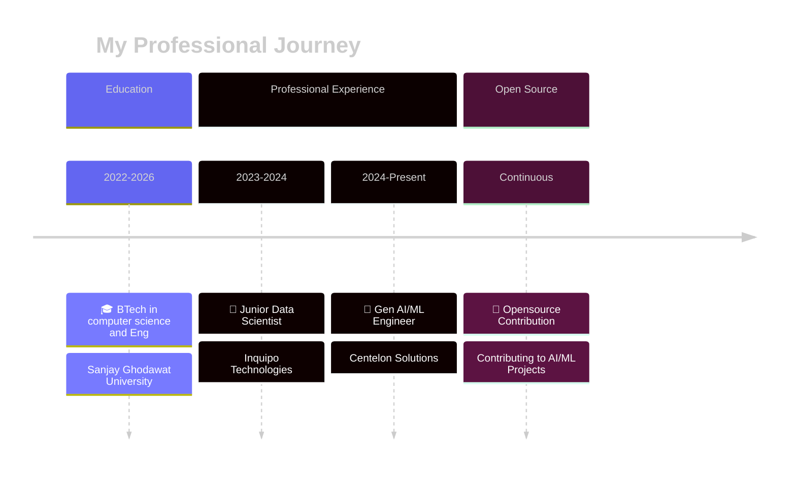

### AI Engineer | Building Intelligent Systems with LLMs & Gen AI

  
  
  
  
  

 

## 💫 About Me

I’m a driven cybersecurity trainee with hands-on experience in penetration testing and web application security, focused on identifying real-world vulnerabilities and understanding attacker behavior.

My journey in cybersecurity is powered by curiosity and persistence. I enjoy mapping attack surfaces, exploiting logic flaws, and breaking applications responsibly to understand how systems fail—and how they can be secured better.

I believe strong security comes from thinking like an attacker while acting with discipline and ethics.

### 🎯 Core Expertise
- 🔍 **Web Application Security** – OWASP Top 10, IDOR, access control flaws
- 🕸️ **Penetration Testing** – Recon, enumeration, exploitation (hands-on labs)
- 🧪 **Security Research** – Real-world vulnerability discovery & testing
- 🧰 **Offensive Tools** – Burp Suite, Nmap, Kali Linux, Metasploit
- ⚙️ **Automation Basics** – Python scripting for security testing

 

## 📚 Experience Timeline

## 🛠️ Tech Stack

### 🤖 AI & Machine Learning

### 🗄️ Vector Databases & Search

### ☁️ Cloud & DevOps

### 🌐 Web Development & Frameworks

### 📊 Data Science & Analytics

## 🌟 Key Achievements

<table>
<tr>
<td align="center" width="25%">

 <b>35%</b>
 Reduction in Dev Time
</td>
<td align="center" width="25%">

 <b>85%+</b>
 Retrieval Accuracy
</td>
<td align="center" width="25%">

 <b>4000+</b>
 Documents Indexed
</td>
<td align="center" width="25%">

 <b>50+</b>
 Developers Empowered
</td>
</tr>
</table>

## 🏅 Certifications

| 🎓 Certification | 🏛️ Organization | 📅 Status |
|:----------------|:----------------|:----------|
| **Ethical Hacking & Web Penetration Testing ** | udemy | ✅ Certified |
| **Generative AI with Large Language Models** | Coursera | ✅ Certified |
| **Deep Learning and Artificial Intelligence** | Udemy | ✅ Certified |
| **Data Analytics Professional Certificate** | LinkedIn | ✅ Certified |

## 📫 Let's Connect!

### 💬 *I'm always excited to collaborate on innovative cybersecurity projects!*

**Open for:** Security Research • Penetration Testing Projects • Bug Bounty Collaboration • Research Opportunities

 

  
  
  
  

 

### ⚡ *"We apply pressure until the cracks show, then we seal them."* ⚡

 

