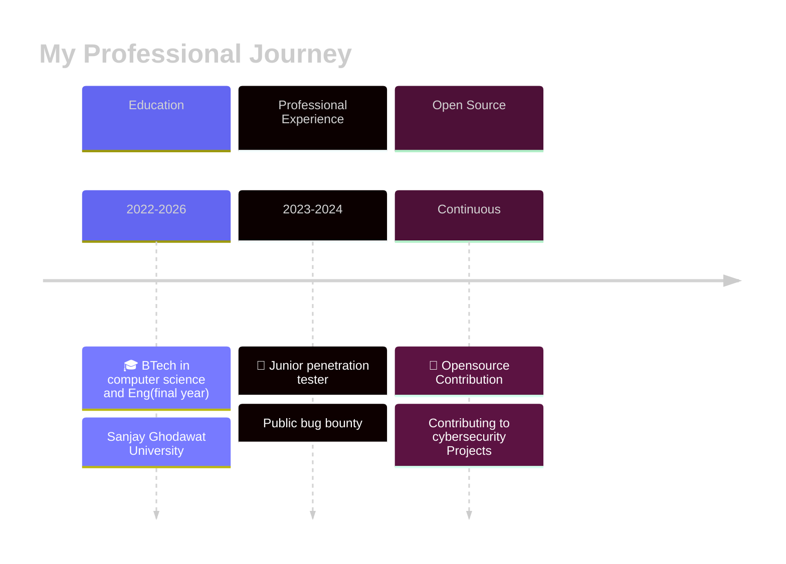

### Cybersecurity Enthusiast | VAPT & Web Application Security | Bug Bounty Practitioner

  
  
  
  
  

 

## 💫 About Me

I’m a driven cybersecurity trainee with hands-on experience in penetration testing and web application security, focused on identifying real-world vulnerabilities and understanding attacker behavior.

My journey in cybersecurity is powered by curiosity and persistence. I enjoy mapping attack surfaces, exploiting logic flaws, and breaking applications responsibly to understand how systems fail—and how they can be secured better.

I believe strong security comes from thinking like an attacker while acting with discipline and ethics.

### 🎯 Core Expertise
- 🔍 **Web Application Security** – OWASP Top 10, IDOR, access control flaws
- 🕸️ **Penetration Testing** – Recon, enumeration, exploitation (hands-on labs)
- 🧪 **Security Research** – Real-world vulnerability discovery & testing
- 🧰 **Offensive Tools** – Burp Suite, Nmap, Kali Linux, Metasploit
- ⚙️ **Automation Basics** – Python scripting for security testing

 

## 📚 Experience Timeline

```mermaid
%%{init: {'theme':'dark', 'themeVariables': {'primaryColor':'#6366F1','primaryTextColor':'#fff','primaryBorderColor':'#818CF8','lineColor':'#A5B4FC','secondaryColor':'#4F46E5','tertiaryColor':'#312E81'}}}%%
timeline
    title My Professional Journey
    section Education
        2022-2026 : 🎓 BTech in computer science and Eng(final year)
                  : Sanjay Ghodawat University
    section Professional Experience
        2023-2024 : 💼 Junior penetration tester
                  : Public bug bounty
    section Open Source
        Continuous : 🌟 Opensource Contribution
             : Contributing to cybersecurity Projects
```

## 🛠️ Tech Stack

### 🛡️ Cybersecurity & Penetration Testing

---

### 🧰 Security Tools & Platforms

---

### 🖥️ Operating Systems & Networking

---

### 🧑‍💻 Programming & Scripting

---

### 🌐 Web & Application Security

---

### 🎯 Practice Platforms

## 🏅 Certifications

| 🎓 Certification | 🏛️ Organization | 📅 Status |
|:----------------|:----------------|:----------|
| **Ethical Hacking & Web Penetration Testing** | udemy | ✅ Certified |
| **Python For Cybersecurity** | Udemy | ✅ Certified |
| **Cisco Networking** | Cisco | ✅ Ongoing |

## 📫 Let's Connect!

### 💬 *I'm always excited to collaborate on innovative cybersecurity projects!*

**Open for:** Security Research • Penetration Testing Projects • Bug Bounty Collaboration • Research Opportunities

 

  
  
  
  

 

### ⚡ *"We apply pressure until the cracks show, then we seal them."* ⚡

 

