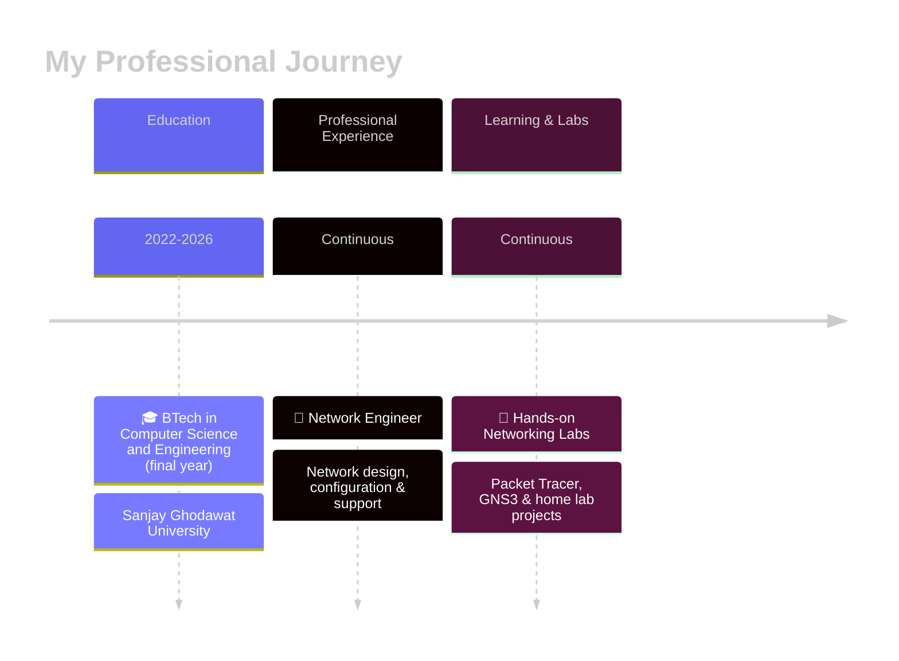

### Network Engineer | Routing & Switching | Network Security & Infrastructure

 

## 💫 About Me

I'm a network engineer focused on designing, configuring, and maintaining reliable network infrastructure. I enjoy working across the stack, from cabling and switching to routing, addressing, and securing the traffic that flows between systems.

My approach is grounded in understanding how networks behave end to end, troubleshooting methodically, and keeping infrastructure resilient, performant, and secure.

With a background in cybersecurity, I bring a security-first mindset to network design, helping build environments that are both efficient and well protected.

### 🎯 Core Expertise

- 🌐 **Routing & Switching** – VLANs, STP, OSPF, EIGRP, static & dynamic routing
- 🔧 **Network Configuration** – Switches, routers, and access points
- 🛡️ **Network Security** – Firewalls, ACLs, VPNs, segmentation
- 📡 **Protocols & Services** – TCP/IP, DNS, DHCP, NAT, HTTP/HTTPS
- 🧪 **Troubleshooting & Monitoring** – Packet analysis, performance and fault diagnosis

 

## 📚 Experience Timeline

```mermaid
%%{init: {'theme':'dark', 'themeVariables': {'primaryColor':'#6366F1','primaryTextColor':'#fff','primaryBorderColor':'#818CF8','lineColor':'#A5B4FC','secondaryColor':'#4F46E5','tertiaryColor':'#312E81'}}}%%
timeline
    title My Professional Journey
    section Education
        2022-2026 : 🎓 BTech in Computer Science and Engineering (final year)
                  : Sanjay Ghodawat University
    section Professional Experience
        Continuous : 💼 Network Engineer
                   : Network design, configuration & support
    section Learning & Labs
        Continuous : 🌟 Hands-on Networking Labs
                   : Packet Tracer, GNS3 & home lab projects
```

## 🛠️ Tech Stack

### 🌐 Networking & Infrastructure

---

### 🧰 Tools & Platforms

---

### 📡 Protocols & Services

---

### 🖥️ Operating Systems

---

### 🧑‍💻 Scripting & Automation

## 🏅 Certifications

<!-- TODO: confirm your actual certifications / status -->
| 🎓 Certification | 🏛️ Organization | 📅 Status |
|:----------------|:----------------|:----------|
| **CCNA (Cisco Certified Network Associate)** | Cisco | 🔄 In Progress |
| **CompTIA Network+** | CompTIA | 🔄 Planned |
| **Cisco Networking** | Cisco | ✅ Certified |

## 📫 Let's Connect!

### 💬 *I'm always excited to collaborate on networking and infrastructure projects!*

**Open for:** Network Design • Infrastructure Projects • Troubleshooting & Support • Learning Opportunities

 

 

### ⚡ *"Connecting systems, securing traffic, and keeping networks running."* ⚡

 

