### AI Engineer | Building Intelligent Systems with LLMs & Gen AI

  
  
  
  
  

 

## 💫 About Me

I'm a **passionate AI Engineer** with **2+ years** of hands-on experience crafting production-grade **Generative AI solutions**. Currently working at **Centelon Solutions** in Bangalore, I specialize in building intelligent systems that make a real difference.

My journey in AI is driven by curiosity and innovation. I love exploring the endless possibilities of **Large Language Models**, architecting sophisticated **RAG pipelines**, and creating **multi-agent systems** that solve complex real-world challenges.

### 🎯 Core Expertise
- 🤖 **Gen AI Development** - LLM applications with GPT-4, Llama-2, Mistral
- 🔍 **RAG Systems** - 85%+ accuracy pipelines with Pinecone & ChromaDB
- ☁️ **Cloud Deployment** - Scalable solutions on AWS SageMaker & Azure
- ⚡ **Model Fine-tuning** - LoRA/PEFT optimization techniques
- 🚀 **API Development** - Robust inference APIs with Flask & FastAPI

 

## 📚 Experience Timeline

```mermaid
%%{init: {'theme':'dark', 'themeVariables': {'primaryColor':'#6366F1','primaryTextColor':'#fff','primaryBorderColor':'#818CF8','lineColor':'#A5B4FC','secondaryColor':'#4F46E5','tertiaryColor':'#312E81'}}}%%
timeline
    title My Professional Journey
    section Education
        2019-2022 : 🎓 Bachelor in Computer Applications
                  : Rani Channamma University
    section Professional Experience
        2023-2024 : 💼 Junior Data Scientist
                  : Inquipo Technologies
        2024-Present : 🚀 Gen AI/ML Engineer
                     : Centelon Solutions
    section Open Source
        Continuous : 🌟 Opensource Contribution
             : Contributing to AI/ML Projects
```

## 🛠️ Tech Stack

### 🤖 AI & Machine Learning

### 🗄️ Vector Databases & Search

### ☁️ Cloud & DevOps

### 🌐 Web Development & Frameworks

### 📊 Data Science & Analytics

## 🌟 Key Achievements

<table>
<tr>
<td align="center" width="25%">

 <b>35%</b>
 Reduction in Dev Time
</td>
<td align="center" width="25%">

 <b>85%+</b>
 Retrieval Accuracy
</td>
<td align="center" width="25%">

 <b>4000+</b>
 Documents Indexed
</td>
<td align="center" width="25%">

 <b>50+</b>
 Developers Empowered
</td>
</tr>
</table>

## 🏅 Certifications

| 🎓 Certification | 🏛️ Organization | 📅 Status |
|:----------------|:----------------|:----------|
| **Oracle Certified Professional - Generative AI** | Oracle | ✅ Certified |
| **Generative AI with Large Language Models** | Coursera | ✅ Certified |
| **Deep Learning and Artificial Intelligence** | Udemy | ✅ Certified |
| **Data Analytics Professional Certificate** | LinkedIn | ✅ Certified |

## 📫 Let's Connect!

### 💬 *I'm always excited to collaborate on innovative AI projects!*

**Open for:** AI Collaborations • Freelance Opportunities • Tech Consulting • Speaking Engagements

 

  
  
  
  

 

### ⚡ *"Building the future with AI, one model at a time"* ⚡

 

